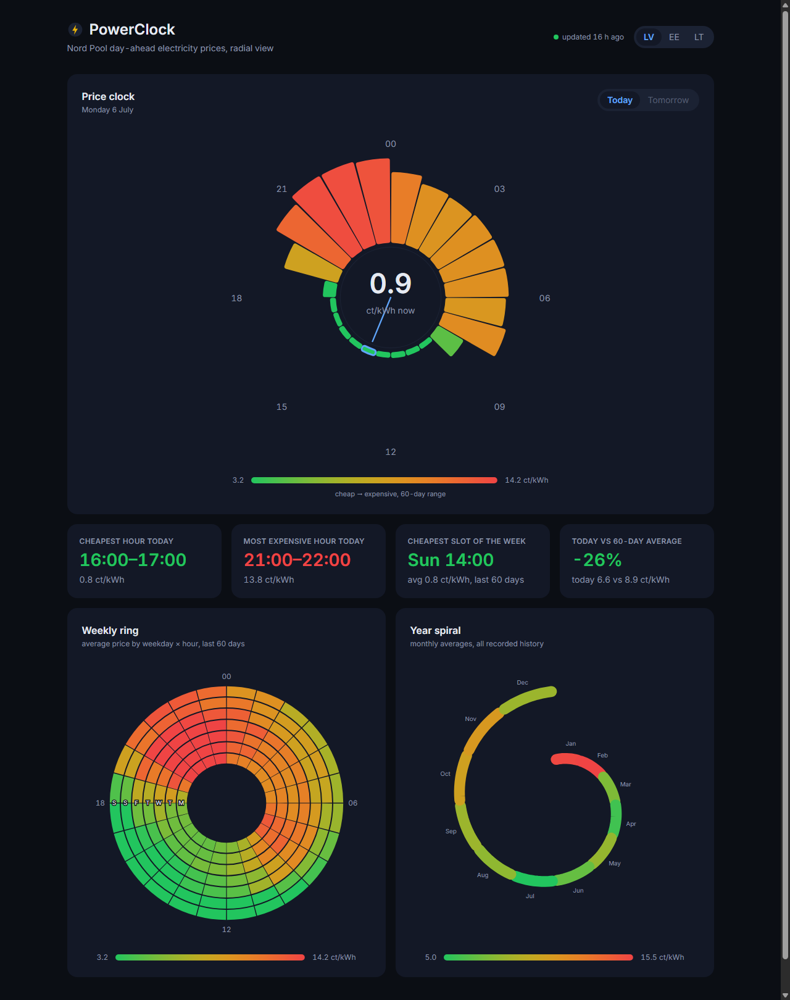

# ⚡ PowerClock

**Nord Pool day-ahead electricity prices for the Baltics, drawn the way the data
actually behaves — in circles.**

Hourly electricity prices are cyclical by nature (day, week, year), yet almost
every tool shows them as flat line charts. PowerClock renders them radially:
a 24-hour price clock, a weekday×hour heatmap ring, and a one-turn year spiral —
so "cheap night / expensive weekday evening / pricey winter" is visible at a
glance, on real, self-updating data.

**Live:** https://kirillpo05-cmd.github.io/PowerClock/



## What this demonstrates

- **Custom D3 visualizations** — three radial charts (radial bars, ring heatmap,
  spiral) built from raw `d3-shape`/`d3-scale` geometry inside React-owned SVG;
  no chart library.
- **A real data pipeline with zero infrastructure** — GitHub Actions cron pulls
  Nord Pool day-ahead prices from the open [Elering API](https://dashboard.elering.ee/en/nps/price),
  normalizes 15-minute UTC slots into hourly **Europe/Riga** days, recomputes
  aggregates and commits versioned JSON snapshots back into the repo. GitHub
  Pages redeploys automatically.
- **Timezone-correct data engineering** — "hour of day" is Riga wall time, not
  UTC; both DST transition days (23-hour and 25-hour) are handled and unit-tested.
- **Deterministic, idempotent tooling** — re-running the pipeline on unchanged
  data produces a byte-identical repo (no noisy commits).
- **Spec-first workflow** — the whole project was built documentation-first:
  idea → [SPEC.md](SPEC.md) → agent configuration → scaffold → modules.

## Features

- **Price clock** — today's (and tomorrow's, once published ~15:30 EET) 24 hours
  as radial bars; current hour highlighted with a needle and a live ct/kWh readout.
- **Weekly ring** — 7 rings × 24 sectors, average prices over the last 60 days:
  the weekly rhythm in one image.
- **Year spiral** — monthly averages along a spiral: seasonality without axes.
- **Insight cards** — cheapest/most expensive hour today, cheapest weekly slot,
  today vs the 60-day average.
- **Zone switcher** — LV / EE / LT (all three zones ship in every snapshot).
- Dark theme, entry animations (with `prefers-reduced-motion` support), exact-value
  tooltips everywhere, data-freshness badge.

## How it works

```
GitHub Actions (cron 13:00 UTC, daily)
  └─ scripts/fetch_prices.mjs
       Elering API (15-min slots, UTC) → hourly Europe/Riga days
       → data/daily/YYYY-MM-DD.json   (zones LV/EE/LT)
       → data/aggregates.json         (weekday×hour matrix, monthly avgs)
       → git commit → GitHub Pages redeploy
React + TypeScript + Vite SPA (static, no backend)
  └─ reads the committed JSON — the browser never calls the API
```

Prices are stored in EUR/MWh (as published) and displayed in ct/kWh (wholesale,
excl. taxes and grid fees).

## Development

```bash
npm install
npm run dev        # Vite dev server
npm test           # Vitest: normalization, aggregates, insights, scales
npm run build      # typecheck + production build (bundles data/)
npm run data       # refresh data/ for yesterday…tomorrow
node scripts/fetch_prices.mjs --from 2025-06-01 --to 2026-07-06   # backfill
```

The pipeline script is dependency-free Node 22; pure logic lives in
`scripts/lib/normalize.mjs` and is imported directly by the tests.

## Deploying your own

1. Fork/push the repo, then in **Settings → Pages** set *Source: GitHub Actions*.
2. Run the **Update price data** workflow once (or wait for the daily cron).
3. If your repo name differs, adjust `base` in `vite.config.ts`.

## License

[MIT](LICENSE) · Data: [Elering](https://dashboard.elering.ee/en/nps/price) /
Nord Pool day-ahead.
