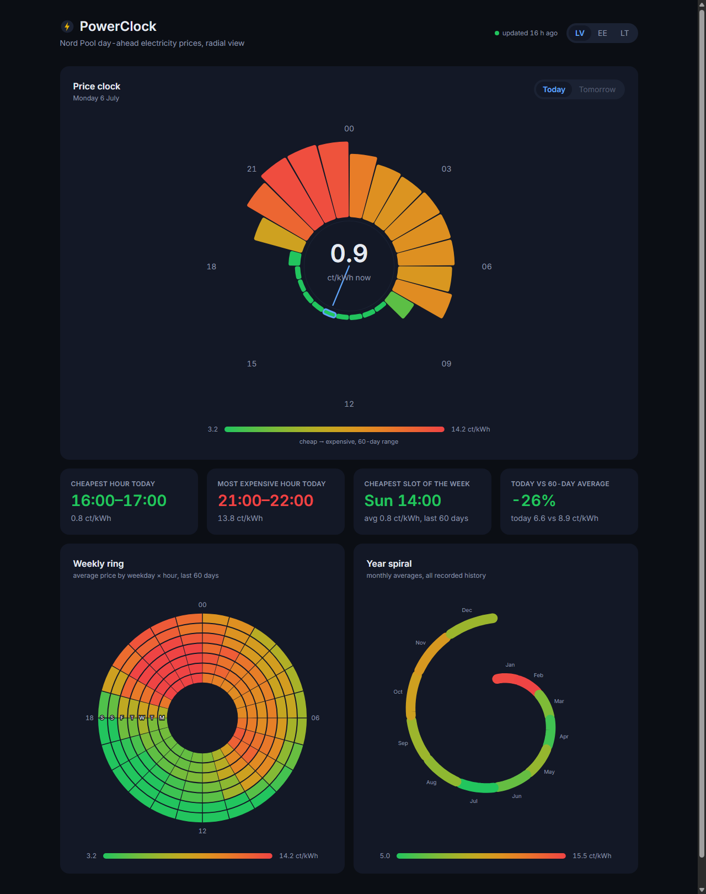

<div align="center">

# ⚡ PowerClock

**Nord Pool day-ahead electricity prices for the Baltics, drawn the way the data actually behaves — in circles.**

[](https://kirillpo05-cmd.github.io/PowerClock/)

[](https://github.com/kirillpo05-cmd/PowerClock/actions/workflows/data.yml)
[](https://github.com/kirillpo05-cmd/PowerClock/actions/workflows/deploy.yml)


<br>

<a href="https://kirillpo05-cmd.github.io/PowerClock/">
  
</a>

</div>

---

## TL;DR

Hourly electricity prices repeat in cycles: day, week, year. Most tools still show them as flat line charts. PowerClock draws them **radially**: a 24-hour price clock, a weekday×hour heatmap ring and a one-turn year spiral. *Cheap nights, expensive weekday evenings, pricey winters* show up at a glance.

It runs on **real, self-updating data** through a **zero-infrastructure pipeline**. No server, no database, no hosting bill.

**▶ Live:** https://kirillpo05-cmd.github.io/PowerClock/

---

## 🎯 What this project demonstrates

- **🎨 Custom D3 visualizations.** Three radial charts (radial bars, ring heatmap, Archimedean spiral) built from D3 primitives (`arc`, `scaleSequential`) and hand-computed geometry. D3 does the math, React renders the SVG. **No chart library.**
- **⚙️ A real data pipeline with zero infrastructure.** A daily GitHub Actions cron pulls Nord Pool day-ahead prices from the open [Elering API](https://dashboard.elering.ee/en/nps/price), turns 15-minute UTC slots into hourly **Europe/Riga** days, recomputes aggregates and commits versioned JSON snapshots back to the repo. GitHub Pages redeploys on its own.
- **🕐 Timezone-correct data engineering.** "Hour of day" means Riga wall time, not UTC. Both DST transition days are covered by unit tests with real dates: the 23-hour spring day (2026-03-29, no hour 03) and the 25-hour autumn day (2025-10-26, doubled hour averaged over 8 slots). Offsets are never hardcoded; everything goes through `Intl.DateTimeFormat`.
- **📊 Honest charts.** Negative prices are valid input and don't break the scales. Missing hours show up as gaps, never as interpolated values. Empty aggregate cells are `null`, not `0`. Every chart has loading, error, empty and success states, a legend and an exact-value tooltip.
- **♻️ Deterministic, idempotent tooling.** Re-running the pipeline on unchanged data produces a **byte-identical repo**, so there are no noisy commits. On any API failure it writes nothing and exits non-zero.
- **📐 Spec-first workflow.** Built documentation-first: idea → [SPEC.md](SPEC.md) → agent configuration → scaffold → modules.

---

## ✨ Features

- **Price clock.** Today's 24 hours as radial bars (tomorrow's too, once published around 15:30 Riga time). The current hour gets a needle and a live ct/kWh readout.
- **Weekly ring.** 7 rings × 24 sectors of average prices over the last 60 days: the weekly rhythm in one image.
- **Year spiral.** Monthly averages over all recorded history (since June 2025) along a one-turn spiral: seasonality without axes.
- **Insight cards.** Cheapest and most expensive hour today, cheapest weekly slot, today vs. the 60-day average.
- **Zone switcher.** LV / EE / LT; all three zones ship in every snapshot.
- **Polish.** Dark theme on design tokens, entry animations that respect `prefers-reduced-motion`, tooltips everywhere, and a data-freshness badge (green ≤ 26 h, yellow ≤ 48 h, red after that). Readable down to 360 px wide.

---

## 🏗️ How it works

```
GitHub Actions (cron 13:00 UTC, daily)
  └─ scripts/fetch_prices.mjs
       Elering API (15-min slots, UTC) → hourly Europe/Riga days
       → data/daily/YYYY-MM-DD.json   (zones LV/EE/LT)
       → data/aggregates.json         (weekday×hour matrix, monthly avgs)
       → git commit → GitHub Pages redeploy

React + TypeScript + Vite SPA (static, no backend)
  └─ reads the committed JSON; the browser never calls the API
```

Prices are stored in EUR/MWh (as published) and displayed in ct/kWh: wholesale, excluding taxes and grid fees.

### Project structure

| Path | What lives there |
|---|---|
| `scripts/fetch_prices.mjs` | Pipeline CLI: fetch → normalize → write snapshots |
| `scripts/lib/normalize.mjs` | Pure slot→hour grouping and aggregates (no I/O, imported by tests) |
| `data/` | Machine-written JSON snapshots, committed by the cron workflow |
| `src/charts/` | `ClockChart`, `WeekRing`, `YearSpiral` |
| `src/lib/` | Data loader, color/price scales, insight functions |
| `src/ui/` | Header, cards, legend, `theme.css` design tokens |
| `tests/` | Vitest: normalization + DST, aggregates, insights, scales |
| `.github/workflows/` | `data.yml` (daily cron), `deploy.yml` (Pages) |

---

## 🛠️ Tech stack

| Layer | Technology |
|---|---|
| **Frontend** | React 18 + TypeScript + Vite (static SPA, no backend) |
| **Visualization** | D3 geometry and scales, rendered as React-owned SVG. No chart library |
| **Styling** | Tailwind CSS v4 + CSS-variable design tokens |
| **Data pipeline** | Dependency-free Node 22 script on a GitHub Actions cron |
| **Testing** | Vitest, 41 unit tests (normalization, DST, aggregates, insights, scales) |
| **Hosting** | GitHub Pages, self-deploying, zero cost |
| **Data source** | [Elering API](https://dashboard.elering.ee/en/nps/price) / Nord Pool day-ahead |

---

## 💻 Development

Requires Node 22+.

```bash
npm install
npm run dev        # Vite dev server
npm test           # Vitest: normalization, aggregates, insights, scales
npm run build      # typecheck + production build (bundles data/)
npm run data       # refresh data/ for yesterday…tomorrow
node scripts/fetch_prices.mjs --from 2025-06-01 --to 2026-07-06   # backfill
```

The pipeline script uses Node built-ins only; its pure logic lives in `scripts/lib/normalize.mjs` and the tests import it directly. Tests never touch the network.

---

## 🚀 Deploying your own

1. Fork the repo, then in **Settings → Pages** set *Source: GitHub Actions*.
2. Run the **Update price data** workflow once (or wait for the daily cron).
3. If your repo isn't named `PowerClock`, change `base` in `vite.config.ts`.

---

## 📄 License

[MIT](LICENSE) · Data: [Elering](https://dashboard.elering.ee/en/nps/price) / Nord Pool day-ahead.
